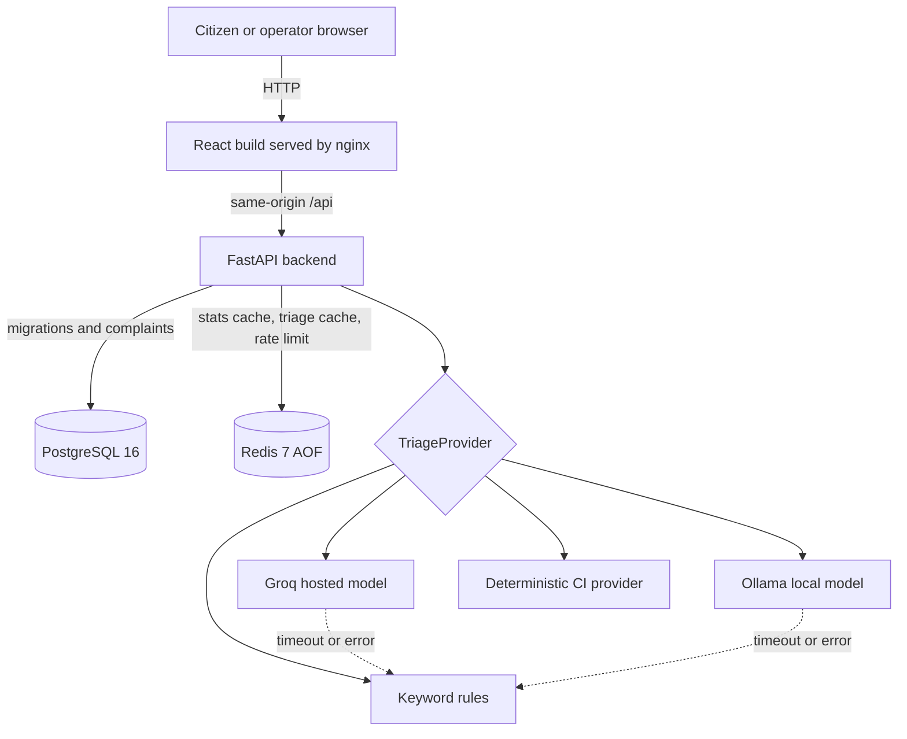
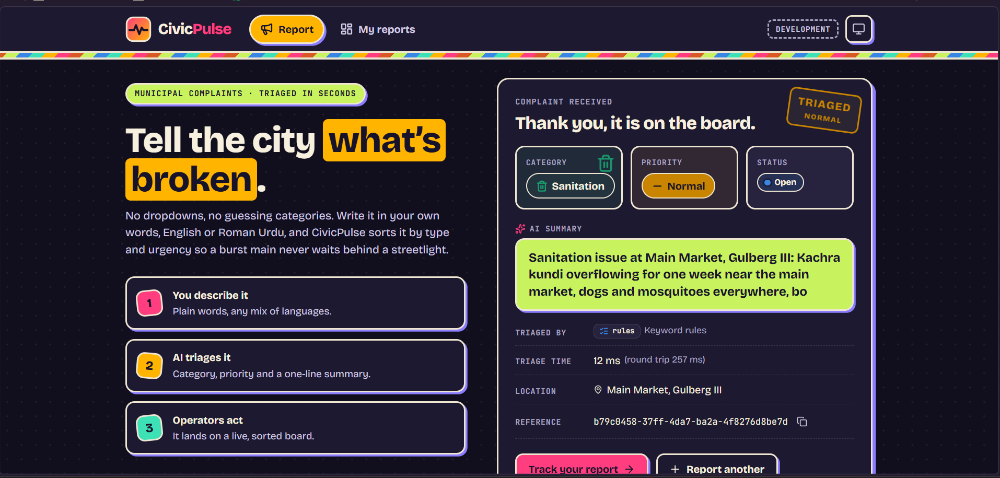
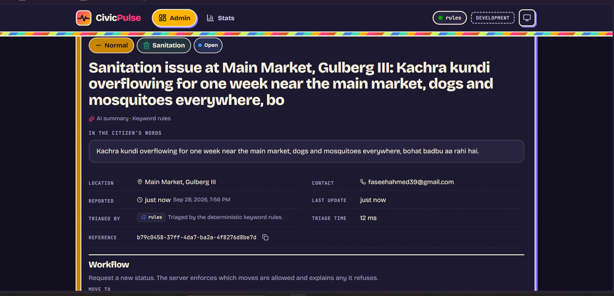
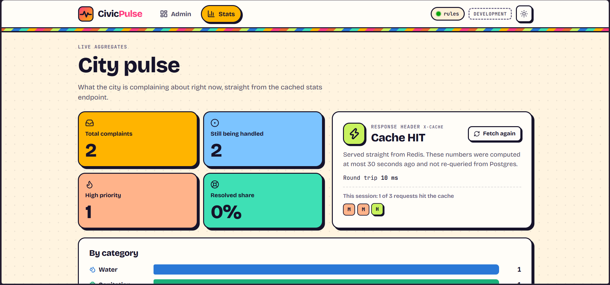
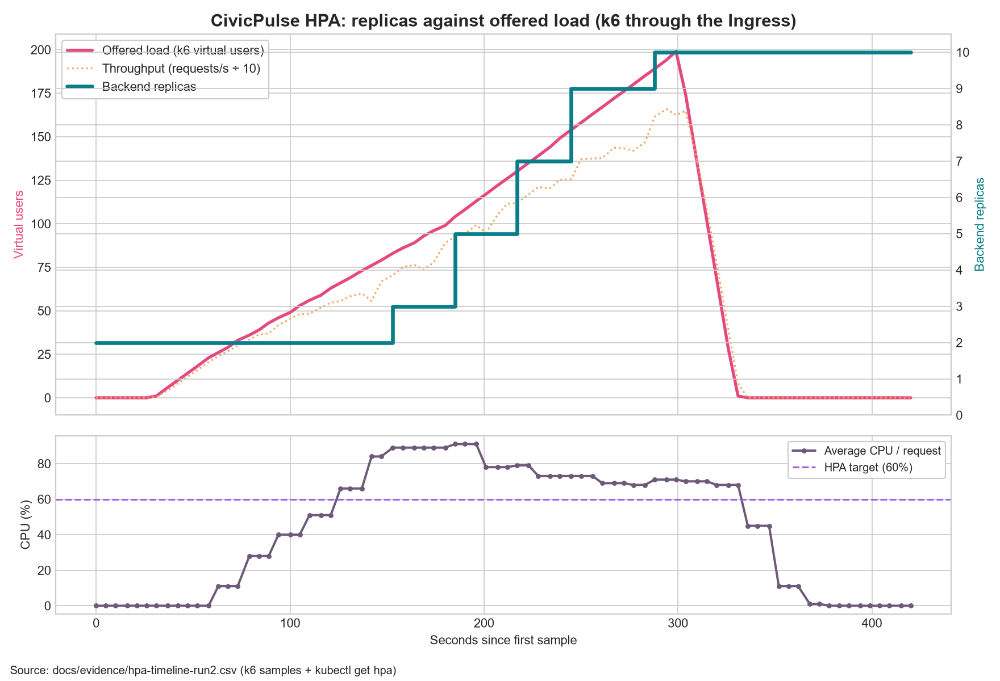

# CivicPulse

[](https://github.com/MugheesHiader476/CivicPulse/actions/workflows/ci.yml)
[](https://github.com/MugheesHiader476/CivicPulse/actions/workflows/cd.yml)

## The problem

Municipal complaint queues usually treat a burst water main and a broken streetlight as equivalent
rows until a person reads them. Citizens also cannot be expected to choose the correct department
or urgency. CivicPulse extracts the category, priority, and short summary from free text while
keeping that classifier replaceable and ensuring an AI outage never prevents complaint intake.

CivicPulse is a municipal complaint intake and operations dashboard. The web UI is
React 18, TypeScript and Vite; FastAPI supplies triage and the API; PostgreSQL stores complaints;
Redis handles caching and submission limits. Nginx serves the production frontend and proxies
same-origin `/api` requests to FastAPI.

## Architecture



In Compose, the frontend joins only `edge`; PostgreSQL and Redis join only the internal network;
the backend is the controlled bridge. Kubernetes uses private ClusterIP Services and exposes only
the Ingress routes for `/` and `/api`.

## Quick start

With Git and Docker Desktop available, a Windows evaluator can clone the repository and run from
PowerShell:

```powershell
git clone https://github.com/MugheesHiader476/CivicPulse.git
cd CivicPulse
powershell -ExecutionPolicy Bypass -File .\scripts\dev-up.ps1
```

`-ExecutionPolicy Bypass` applies only to that one process, so it works on a fresh Windows machine
whose default policy blocks local scripts; it does not change any system setting.

On Linux or macOS, use the Bash launcher:

```bash
git clone https://github.com/MugheesHiader476/CivicPulse.git
cd CivicPulse
bash scripts/dev-up.sh
```

The script creates a private `.env` with a random database password if one does not exist,
builds images, waits for PostgreSQL and Redis, applies Alembic migrations, and seeds 30 complaints.
It prints two local evaluation links: `/?demo_role=citizen` and `/?demo_role=operator`. No account
or third-party secret is required for this local demo. The fixed demo identities are accepted only
when `AUTH_MODE=demo`; production Compose and Kubernetes explicitly enforce `AUTH_MODE=clerk`.

A citizen sees only **Report** and **My reports**. Citizens submit complaints; operators review
them, change their status, and see city-wide numbers. An operator sees only **Admin** and **Stats**.
The API enforces the same role split rather than trusting the browser.

To test real Clerk authentication locally, set `AUTH_MODE=clerk` in `.env`, create a Clerk
application, and run `clerk env pull` in `frontend/` to create the ignored
`frontend/.env.local`. Add operator Clerk user IDs to `CLERK_OPERATOR_USER_IDS`, then rerun the
script. The script derives the exact Clerk frontend API origin for nginx's content security policy.

The production placeholder is in `.env.example`. `CLERK_OPERATOR_USER_IDS` takes user IDs, not
an email address, password, Clerk secret, or publishable key.

Reports created before the ownership migration (including seeded sample reports) have no linked account and appear only in Admin. New reports are linked to their submitting account. The normal startup script applies the migration; for an existing deployment run `alembic upgrade head` before accepting submissions.

Run `docker compose down` to stop the stack without erasing data. Run
`docker compose exec backend python -m app.seed` to seed again; it adds zero duplicate rows.

See [backend README](backend/README.md) for access policy, API behavior and tests, and
[frontend README](frontend/README.md) for Vite development.

## Screenshots

| Citizen submission with AI triage result | Operator dashboard |
|---|---|
|  |  |
| **Stats with the X-Cache state** | **HPA scaling under k6 load** |
|  |  |

## API contract

All `/api` endpoints require a verified Clerk session in deployed environments. Explicit local demo
mode uses two fixed evaluation identities. In both modes, `operator` means the user ID is present
in `CLERK_OPERATOR_USER_IDS`; citizens can access only their own reports.

| Method | Path | Access | Behavior |
|---|---|---|---|
| `GET` | `/api/me` | signed in | Return `citizen` or `operator` role |
| `POST` | `/api/complaints` | citizen | Validate, triage, persist; `201`, `400`, or rate-limited `429` |
| `GET` | `/api/my/complaints` | citizen | Paginated reports owned by the account |
| `GET` | `/api/my/complaints/{id}` | citizen | Owned report or `404` |
| `GET` | `/api/complaints` | operator | Filtered, paginated city-wide board |
| `GET` | `/api/complaints/{id}` | operator | Complaint detail or `404` |
| `PATCH` | `/api/complaints/{id}/status` | operator | Enforce transition table; invalid move is `409` |
| `GET` | `/api/stats` | operator | Aggregates with `X-Cache: HIT\|MISS` |
| `GET`/`PUT` | `/api/meta/providers` | operator | Inspect outcomes or choose an available provider |
| `GET` | `/health` | public | Liveness only; never touches dependencies |
| `GET` | `/ready` | public | PostgreSQL and Redis readiness |
| `GET` | `/metrics` | public | Prometheus request and triage metrics |

In local demo mode (`AUTH_MODE=demo`, the default for `scripts/dev-up`), the two fixed evaluation
identities are sent as bearer tokens, so the contract can be exercised directly with curl:

```bash
curl -i -X POST http://127.0.0.1:8080/api/complaints -H "Authorization: Bearer demo-citizen" -H "Content-Type: application/json" -d '{"text":"Burst water main flooding Street 12 since fajr","location":"Street 12, Lahore"}'
curl -i http://127.0.0.1:8080/api/stats -H "Authorization: Bearer demo-operator"
curl -i http://127.0.0.1:8080/api/meta/providers -H "Authorization: Bearer demo-operator"
```

A request without a token returns `401`; a citizen token on an operator route returns `403`.
These demo tokens are rejected whenever `AUTH_MODE=clerk`.

## AI provider choice

Set `GROQ_API_KEY` in the private root `.env` for Groq. Run `bash scripts/dev-up.sh`
for the hosted option. To enable the local option, run:

```bash
bash scripts/dev-up.sh --local
```

The local command starts the optional Ollama service, downloads
`llama3.2:1b-instruct-q4_K_M` (about 808 MB), and warms it. The Ollama image needs
additional disk space and the local service is limited to 2 CPUs and 3 GB RAM.
Nothing is downloaded when you run without `--local`.

Sign in as an operator and open **Stats → Choose AI triage**. Select **Groq cloud**
or **Local Ollama**; unavailable choices are disabled. The choice applies to new
complaints across backend replicas and survives restarts in Redis. `TRIAGE_PROVIDER`
(`llm` for Groq, `ollama` for local, or `rules`) is only the initial default before
an operator selects a provider. Switching does not reclassify old complaints or
change the safety fallback: a failed AI call falls back to keyword rules. Groq
receives complaint text; the local option keeps it inside the Compose network.
The key never goes to the browser.

## Continuous integration

[`.github/workflows/ci.yml`](.github/workflows/ci.yml) runs on pull requests targeting
`main`, pushes to `dev`, and manual dispatch. It checks Ruff, mypy, ESLint and TypeScript;
runs backend tests with a 65% coverage gate and frontend component tests; builds both
container images without pushing them; scans each image with pinned Trivy for fixable HIGH and
CRITICAL vulnerabilities; and runs an isolated Compose smoke test through nginx to the
API, PostgreSQL and Redis. The smoke test signs a session with a temporary CI-only key
and uses `TRIAGE_PROVIDER=simulated`, so CI needs no Clerk or Groq account secrets.

After pushing the workflow, enable a `main` branch ruleset in GitHub: require a pull
request, one approval, and the CI checks before merging. GitHub only lists check names
after the workflow has run once. The manifest job renders `k8s/overlays/prod` and validates
standard resources with kubeconform; VPA is an external CRD installed by CD.

## Continuous delivery and release

On a push to protected `main`, `cd.yml` reruns the full suite, builds each image once, pushes
`github.sha` and `latest` tags to GHCR, records digests, generates SBOMs, scans both images, and
deploys the **SHA tags** (never `latest`) to an ephemeral kind cluster. It installs Ingress,
metrics-server, and VPA, waits for migrations/rollouts, then runs an authenticated complaint and
cache smoke test through the Ingress. Publishing and deploying jobs are gated with `needs:`.

Tags matching `v*` trigger `release.yml`, which retests, publishes semantic image tags, generates
release notes, and attaches both SBOMs to the GitHub release.

Production Compose also deploys immutable published images:

```bash
cp .env.example .env
# Fill secrets, GHCR_OWNER, and IMAGE_TAG with a real commit SHA.
docker compose -f compose.prod.yaml up -d
```

For Kubernetes, follow [the runbook](docs/RUNBOOK.md). It creates the Secret before workloads,
applies `k8s/overlays/dev` or renders the production SHA, waits for each rollout, and documents
both emergency and declarative rollback.


## Documentation and evidence

- [Provider-interface ADR](docs/adr/0001-provider-interface.md)
- [Frontend runtime-config ADR](docs/adr/0002-frontend-runtime-config.md)
- [Deploy-by-SHA ADR](docs/adr/0003-deploy-by-sha.md)
- [PII/data-governance ADR](docs/adr/0004-pii-and-data-governance.md)
- [Triage design](docs/TRIAGE.md)
- [Operations runbook](docs/RUNBOOK.md)
- [Engineering notes](docs/ENGINEERING-NOTES.md)
- [AI assistance disclosure](docs/AI-USAGE.md)
- [Submission report source and rubric checklist](docs/SUBMISSION-REPORT.md)
- [Screenshot and evidence capture guide](docs/EVIDENCE-GUIDE.md)
- [Under-five-minute demo script and commands](docs/DEMO-SCRIPT.md)

The implementation now includes the application, production Compose, Kubernetes, CI, CD, release,
and load-test definitions. Real HPA/VPA output, a scaling chart, application captures, clean-clone
Docker evidence, protected red-to-green CI, branch-protection settings, and conflict evidence are
catalogued in `docs/evidence/`. The successful final CD/GHCR/release links and demo video must still
come from real post-merge runs before submission; they are not fabricated in this repository.

Run the mechanical preflight from the repository root:

```bash
python scripts/check_submission.py
```
