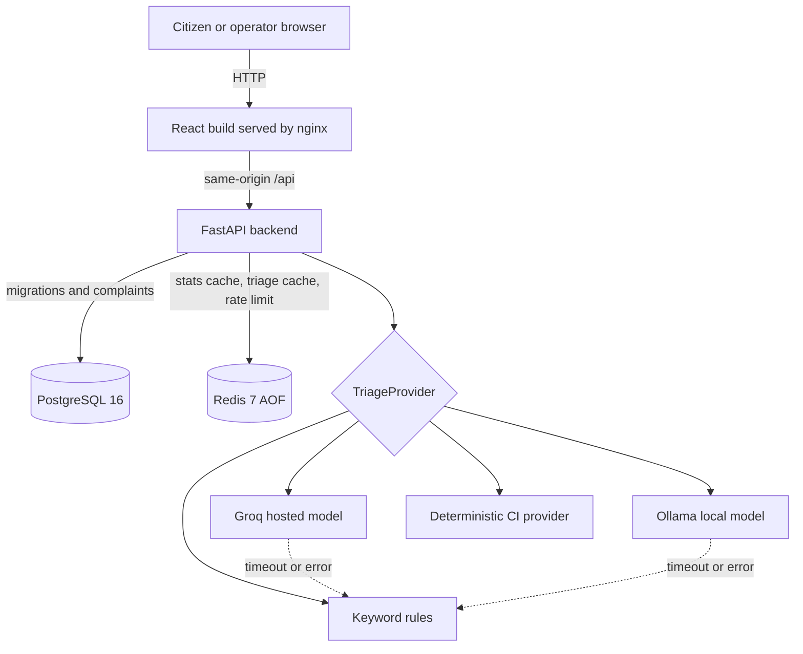

# CivicPulse

[](https://github.com/MugheesHiader476/CivicPulse/actions/workflows/ci.yml)
[](https://github.com/MugheesHiader476/CivicPulse/actions/workflows/cd.yml)

## The problem

Municipal complaint queues usually treat a burst water main and a broken streetlight as equivalent
rows until a person reads them. Citizens also cannot be expected to choose the correct department
or urgency. CivicPulse extracts the category, priority, and short summary from free text while
keeping that classifier replaceable and ensuring an AI outage never prevents complaint intake.

Municipal complaint intake and operations dashboard built from the attached SRS. The web UI is
React 18, TypeScript and Vite; FastAPI supplies triage and the API; PostgreSQL stores complaints;
Redis handles caching and submission limits. Nginx serves the production frontend and proxies
same-origin `/api` requests to FastAPI.

## Architecture



In Compose, the frontend joins only `edge`; PostgreSQL and Redis join only the internal network;
the backend is the controlled bridge. Kubernetes uses private ClusterIP Services and exposes only
the Ingress routes for `/` and `/api`.

## Quick start

Create a Clerk application, then run `clerk env pull` in `frontend/` to create
`frontend/.env.local`. With Docker running, from this directory:

```bash
bash scripts/dev-up.sh
```

The script creates a private `.env` with a random database password if one does not exist,
builds images, applies Alembic migrations, and seeds 30 complaints. If you already have a
`.env`, set a nonempty `POSTGRES_PASSWORD` there. Open <http://127.0.0.1:8080/sign-in>.
A signed-in citizen sees only **Report** and **My reports**. Citizens submit complaints; administrators review them, change their status, and see city-wide numbers. An administrator sees only **Admin** (the complaint board) and **Stats** and lands on the board after sign-in. Admin accounts cannot submit complaints. To grant admin access, add the Clerk user ID of each administrator to `CLERK_OPERATOR_USER_IDS` in `.env` (comma separated), then rerun the script. The API enforces the same role split.

The placeholder is in `.env.example`: replace `user_replace_with_admin_clerk_id` with the administrator's user ID from the Clerk Dashboard. Sign in at `/sign-in` using that Clerk account to open Admin and Stats. Use a different, non-allowlisted Clerk account to submit and track reports. This setting takes user IDs, not an email address, password, Clerk secret, or publishable key. The script derives the exact Clerk frontend API origin from the publishable key for nginx's content security policy.

Reports created before the ownership migration (including seeded sample reports) have no linked account and appear only in Admin. New reports are linked to their submitting account. The normal startup script applies the migration; for an existing deployment run `alembic upgrade head` before accepting submissions.

Run `docker compose down` to stop the stack without erasing data. Run
`docker compose exec backend python -m app.seed` to seed again; it adds zero duplicate rows.

See [backend README](backend/README.md) for access policy, API behavior and tests, and
[frontend README](frontend/README.md) for Vite development. The SRS is in `SRS/`.

## API contract

All `/api` endpoints require a verified Clerk session. `operator` means the user ID is present in
`CLERK_OPERATOR_USER_IDS`; citizens can access only their own reports.

| Method | Path | Access | Behavior |
|---|---|---|---|
| `GET` | `/api/me` | signed in | Return `citizen` or `operator` role |
| `POST` | `/api/complaints` | citizen | Validate, triage, persist; `201`, `400`, or rate-limited `429` |
| `GET` | `/api/my/complaints` | citizen | Paginated reports owned by the account |
| `GET` | `/api/my/complaints/{id}` | citizen | Owned report or `404` |
| `GET` | `/api/complaints` | operator | Filtered, paginated city-wide board |
| `GET` | `/api/complaints/{id}` | operator | Complaint detail or `404` |
| `PATCH` | `/api/complaints/{id}/status` | operator | Enforce transition table; invalid move is `409` |
| `GET` | `/api/stats` | operator | Aggregates with `X-Cache: HIT\|MISS` |
| `GET`/`PUT` | `/api/meta/providers` | operator | Inspect outcomes or choose an available provider |
| `GET` | `/health` | public | Liveness only; never touches dependencies |
| `GET` | `/ready` | public | PostgreSQL and Redis readiness |
| `GET` | `/metrics` | public | Prometheus request and triage metrics |

## AI provider choice

Set `GROQ_API_KEY` in the private root `.env` for Groq. Run `bash scripts/dev-up.sh`
for the hosted option. To enable the local option, run:

```bash
bash scripts/dev-up.sh --local
```

The local command starts the optional Ollama service, downloads
`llama3.2:1b-instruct-q4_K_M` (about 808 MB), and warms it. The Ollama image needs
additional disk space and the local service is limited to 2 CPUs and 3 GB RAM.
Nothing is downloaded when you run without `--local`.

Sign in as an operator and open **Stats → Choose AI triage**. Select **Groq cloud**
or **Local Ollama**; unavailable choices are disabled. The choice applies to new
complaints across backend replicas and survives restarts in Redis. `TRIAGE_PROVIDER`
(`llm` for Groq, `ollama` for local, or `rules`) is only the initial default before
an operator selects a provider. Switching does not reclassify old complaints or
change the safety fallback: a failed AI call falls back to keyword rules. Groq
receives complaint text; the local option keeps it inside the Compose network.
The key never goes to the browser.

## Continuous integration

[`.github/workflows/ci.yml`](.github/workflows/ci.yml) runs on pull requests targeting
`main`, pushes to `dev`, and manual dispatch. It checks Ruff, mypy, ESLint and TypeScript;
runs backend tests with a 65% coverage gate and frontend component tests; builds both
container images without pushing them; scans each image with pinned Trivy for fixable HIGH and
CRITICAL vulnerabilities; and runs an isolated Compose smoke test through nginx to the
API, PostgreSQL and Redis. The smoke test signs a session with a temporary CI-only key
and uses `TRIAGE_PROVIDER=simulated`, so CI needs no Clerk or Groq account secrets.

After pushing the workflow, enable a `main` branch ruleset in GitHub: require a pull
request, one approval, and the CI checks before merging. GitHub only lists check names
after the workflow has run once. The manifest job renders `k8s/overlays/prod` and validates
standard resources with kubeconform; VPA is an external CRD installed by CD.

## Continuous delivery and release

On a push to protected `main`, `cd.yml` reruns the full suite, builds each image once, pushes
`github.sha` and `latest` tags to GHCR, records digests, generates SBOMs, scans both images, and
deploys the **SHA tags** (never `latest`) to an ephemeral kind cluster. It installs Ingress,
metrics-server, and VPA, waits for migrations/rollouts, then runs an authenticated complaint and
cache smoke test through the Ingress. Publishing and deploying jobs are gated with `needs:`.

Tags matching `v*` trigger `release.yml`, which retests, publishes semantic image tags, generates
release notes, and attaches both SBOMs to the GitHub release.

Production Compose also deploys immutable published images:

```bash
cp .env.example .env
# Fill secrets, GHCR_OWNER, and IMAGE_TAG with a real commit SHA.
docker compose -f compose.prod.yaml up -d
```

For Kubernetes, follow [the runbook](docs/RUNBOOK.md). It creates the Secret before workloads,
applies `k8s/overlays/dev` or renders the production SHA, waits for each rollout, and documents
both emergency and declarative rollback.


## Documentation and evidence

- [Provider-interface ADR](docs/adr/0001-provider-interface.md)
- [Frontend runtime-config ADR](docs/adr/0002-frontend-runtime-config.md)
- [Deploy-by-SHA ADR](docs/adr/0003-deploy-by-sha.md)
- [PII/data-governance ADR](docs/adr/0004-pii-and-data-governance.md)
- [Triage design](docs/TRIAGE.md)
- [Operations runbook](docs/RUNBOOK.md)
- [Engineering notes](docs/ENGINEERING-NOTES.md)
- [AI assistance disclosure](docs/AI-USAGE.md)

The implementation now includes the application, production Compose, Kubernetes, CI, CD, release,
and load-test definitions. Real branch-protection/conflict screenshots, HPA/VPA captures, scaling
chart, successful CD/GHCR links, and the demo video must be produced from actual GitHub and cluster
runs before submission; they are not fabricated in this repository.

Run the mechanical preflight from the repository root:

```bash
python scripts/check_submission.py
```
