# CivicPulse - Software Construction and Design assignment report

**Assignment:** Software Construction and Design - Assignment 1

**Students:** Faseeh Ahmed (24I-3009) and Mughees Haider (24I-3181)

**Submitted to:** Mr. Peer Sami Ullah

**Submission date:** September 29, 2026

**Repository:** [CivicPulse on GitHub](https://github.com/MugheesHiader476/CivicPulse)

**Release pull request:** [PR #19](https://github.com/MugheesHiader476/CivicPulse/pull/19)
**Released main SHA (`v1.0.0`):** `825cd2a` - [successful CD run](https://github.com/MugheesHiader476/CivicPulse/actions/runs/36565755282)

## 1. Executive summary

CivicPulse is a municipal complaint intake and operations system. Citizens describe a problem in
English or Roman Urdu without choosing a department. The backend classifies category and priority,
creates a short summary, stores the report, and keeps intake available through deterministic rules
if an AI provider fails. Operators receive a filtered workflow board, controlled status
transitions, cached city statistics, and provider health information.

The delivered system combines a React/TypeScript frontend, FastAPI backend, PostgreSQL, Redis,
Groq/Ollama/rules triage providers, segmented Docker Compose networking, Kubernetes, and protected
GitHub Actions CI/CD. A fresh evaluator needs Git and Docker Desktop, then only the clone, directory,
and startup commands below.

## 2. Reproduction from a clean computer

Windows PowerShell:

```powershell
git clone https://github.com/MugheesHiader476/CivicPulse.git
cd CivicPulse
powershell -ExecutionPolicy Bypass -File .\scripts\dev-up.ps1
```

Linux/macOS:

```bash
git clone https://github.com/MugheesHiader476/CivicPulse.git
cd CivicPulse
bash scripts/dev-up.sh
```

The launcher creates an ignored local configuration with a random database password, builds the
images, starts PostgreSQL and Redis, migrates and seeds the database, and prints citizen/operator
URLs. Demo authentication is restricted to `AUTH_MODE=demo`; production Compose and Kubernetes
force Clerk authentication.

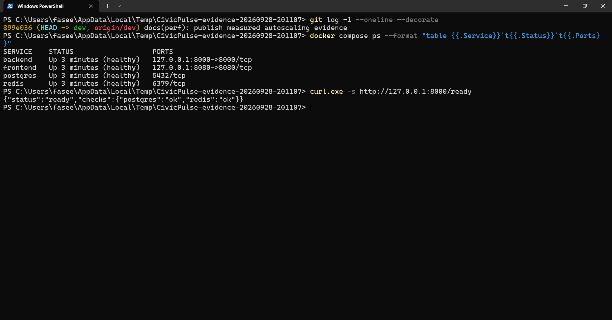

The clean-clone capture shows backend, frontend, PostgreSQL, and Redis healthy. The backend image is
approximately 322 MB and the frontend image 94.2 MB. Both contain health checks and run as non-root
users; only ports 8000 and 8080 bind to loopback on the host.

## 3. Architecture and design decisions

The browser calls same-origin `/api`. Nginx or Kubernetes Ingress routes that path to FastAPI.
PostgreSQL and Redis have no public ports. The backend owns authorization, validation, workflow
rules, cache invalidation, rate limiting, and AI fallback.

- ADR 0001 defines the replaceable triage-provider interface.
- ADR 0002 keeps frontend runtime configuration outside the immutable bundle.
- ADR 0003 requires build-once, deploy-by-SHA delivery.
- ADR 0004 records PII minimization, retention, and logging boundaries.

In Compose, the frontend joins only the edge network; PostgreSQL and Redis join only the internal
network; the backend is the controlled bridge. Kubernetes uses private ClusterIP services and
exposes only Ingress routes.

## 4. Application behaviour

The citizen interface validates inputs, submits a natural-language complaint, and displays the
server-owned classification, reference, provider, and timing. Citizens can retrieve only reports
owned by their authenticated identity. The operator interface supports filtering, detail,
pagination, legal status transitions, aggregate charts, cache evidence, and provider selection.


Validation and workflow rules are enforced at both suitable layers. Short input is rejected before
submission, while the backend rejects an illegal resolved-to-open transition with HTTP 409. The
rate limiter allowed six test submissions and returned HTTP 429 for the seventh.

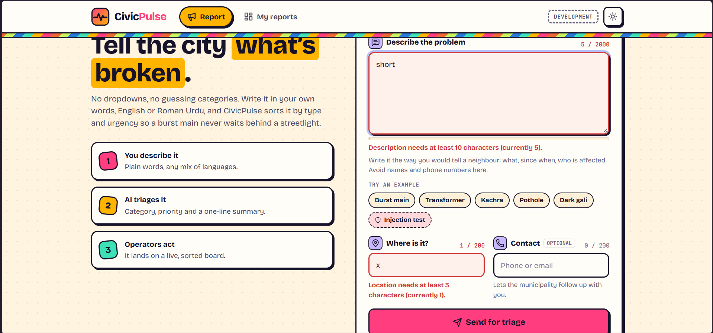

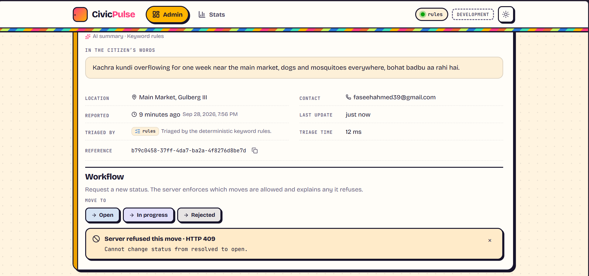

## 5. Backend, data, cache, and AI verification

The final backend suite contains 47 tests with 90.37% application coverage. Ruff and mypy pass.
The frontend contains 43 Vitest tests; ESLint, TypeScript, and the Vite production build pass.
Alembic migrations define the schema and indexes for workflow filters, chronology, and citizen
ownership. PostgreSQL uses a persistent volume in both Compose and Kubernetes.

Redis provides the statistics cache, provider selection/outcome history, inference caching, and
rate windows. The first statistics request is a MISS computed from PostgreSQL; the repeated request
is a HIT served from Redis. Complaint writes invalidate the aggregate cache.

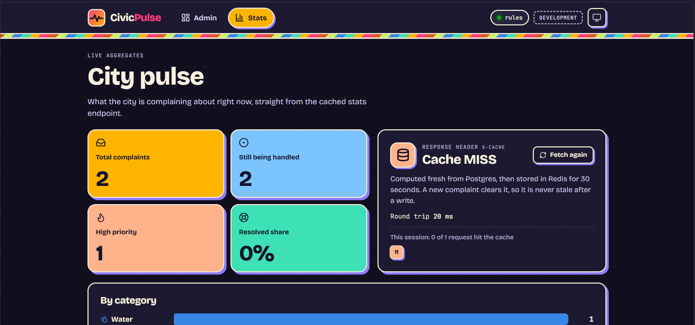


Groq, local Ollama, simulated CI, and keyword rules implement one typed provider contract. Provider
output is schema validated, transient failures are retried once, and final provider failure records
an outcome before rules complete the complaint. CI uses only the deterministic simulated provider;
it never requires a live AI key.

Duplicate complaints are served from a Redis cache keyed by a SHA-256 hash of provider, model, and
normalised text and location, kept for 24 hours. In a measured run of 19 submissions containing 12
distinct complaints, the cache counters recorded 7 hits and 12 misses, a 36.8% hit rate: every
repeat avoided a new classification. The seed now loads 30 distinct Urdu-influenced complaints,
five per category, and remains idempotent. Application logs are single-line JSON on standard
output, each carrying the request ID.

## 6. Docker and Kubernetes

Dockerfiles use multi-stage builds, pinned runtime bases, non-root users, health checks, and narrow
build contexts. Measured with and without `.dockerignore`, the backend context fell from about 220 MB
(8,221 files) to 0.4 MB (61 files) and the frontend context from about 257 MB (17,734 files) to
0.6 MB (62 files). The measurement also exposed a 26 MB `.mypy_cache` that the backend ignore file
had missed; it was added and re-measured. The frontend build stage is 636 MB and the final image
94.2 MB; the application adds under 1 MB and the rest is the pinned `nginx:1.30.5-alpine3.24` base,
which bundles the njs and ACME modules. The backend builder stage is 335 MB and the final image
323 MB. Raw figures are in `docs/evidence/image-and-context-sizes.txt`. Compose waits on health, runs migration as a one-shot service, persists database and
Redis data, and separates edge, internal, AI, and model-egress networks.

The Kubernetes base includes a Namespace, ConfigMap, Secret contract, PostgreSQL StatefulSet and
PVC, Redis deployment and PVC, migration Job, replicated frontend/backend Deployments, probes,
requests/limits, Services, Ingress, HPA, recommendation-only VPA, and a PodDisruptionBudget.
Development and production overlays render from the same base.

The demonstrated local cluster is `kind-civicpulse`: one named kind (Kubernetes in Docker) cluster
running on Docker Desktop. Consistent `app.kubernetes.io` labels and matching selectors connect
Deployments, pods, and Services to the intended workloads. PostgreSQL and Redis use PVC-backed
storage, so data survives pod deletion and recreation. Because this is a disposable local kind
cluster rather than an external managed storage service, deleting the entire cluster is outside
that durability guarantee.

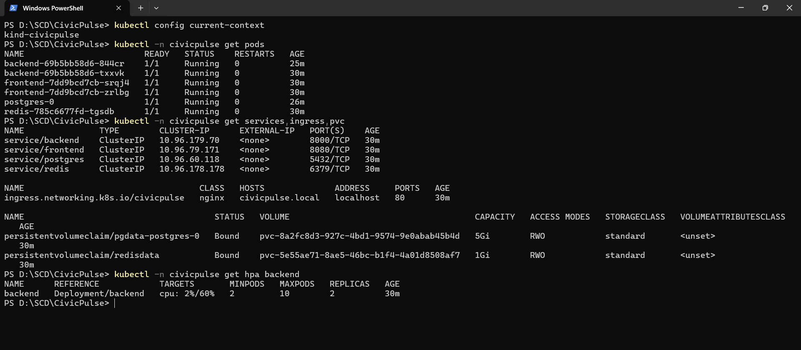

The real load test sent 150,559 requests with zero failures, average latency 90.81 ms, p95 252.38
ms, and up to 199 observed virtual users. CPU first exceeded the 60% HPA target at 19:46:01; replicas
first increased at 19:46:22, an observed 21-second controller-to-replica lag. The deployment grew
from 2 to 9 replicas. Scale-down is deliberately protected by a 300-second stabilization window.

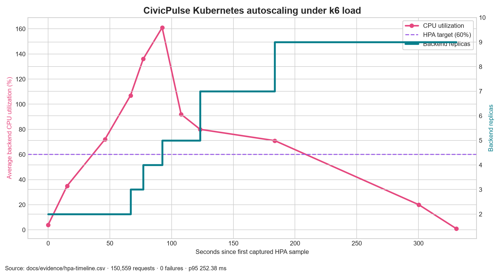

VPA remained in `Off` mode to avoid changing CPU requests underneath the utilization-based HPA. It
recommended a 977m CPU target and 250Mi memory target during the measured load. The backend request
was then changed from the guessed 200m CPU / 256Mi memory to that 977m / 250Mi target and the load
test was run again. Run 1 had used `kubectl port-forward`, which sends every request to one pod, so
run 2 sent the same k6 stages through the Ingress to spread load across all replicas.

Run 2 completed 248,691 requests at 829 requests per second with zero failures and p95 40.78 ms.
CPU first exceeded the target at 18:13:22 and the first replica was added at 18:13:49, a 27-second
lag. The deployment grew 2 -> 3 -> 5 -> 7 -> 9 -> 10 as offered load rose to 189 virtual users.
With the larger request each pod absorbs about 586m of CPU before the HPA reacts, against 120m
before, yet the balanced path did far more total work and the HPA reached its 10-replica ceiling
with CPU still near 70%. At that point autoscaling cannot add capacity, which is why the maximum
replica count and node capacity must be planned. After run 2 the VPA target fell to 763m, because
run 1 had concentrated all traffic on one pod.


## 7. Collaboration and Git evidence

The final repository history contains 74 commits across all refs: 46 by Faseeh and 28 by Mughees
(approximately 62.2% / 37.8%), so both partners remain above the required 35% share. `.mailmap`
combines Faseeh's two verified email identities without rewriting history.

Six early bootstrap commits (24-26 September: initial frontend, backend, login, CodeQL, and two
work-in-progress commits) were pushed directly to `main` before the `dev` branch and the protection
ruleset existed. From PR #1 onward, all work reached `main` through pull requests. Two small CD
hotfixes (PRs #20 and #21) were opened from feature branches directly against `main` after the
release, then merged back into `dev` so both branches match. These commits and their original
messages are kept as they are, because rewriting shared, protected history would be more harmful
than the inconsistency it hides.

At least five issue-linked PRs contain substantive partner review:

- Issue [#10](https://github.com/MugheesHiader476/CivicPulse/issues/10), PR [#11 cleanup](https://github.com/MugheesHiader476/CivicPulse/pull/11): Mughees authored it; Faseeh approved the focused removal; merged.
- Issue [#12](https://github.com/MugheesHiader476/CivicPulse/issues/12), PR [#13 boundary regression](https://github.com/MugheesHiader476/CivicPulse/pull/13): Faseeh authored it; Mughees reviewed matcher semantics and tests; merged.
- Issue [#14](https://github.com/MugheesHiader476/CivicPulse/issues/14), PR [#15 competing fix](https://github.com/MugheesHiader476/CivicPulse/pull/15): Mughees authored it; Faseeh reviewed conflict resolution and tests; merged.
- Issue [#16](https://github.com/MugheesHiader476/CivicPulse/issues/16), PR [#17 repository cleanup](https://github.com/MugheesHiader476/CivicPulse/pull/17): Faseeh authored it; Mughees approved scope and author mapping; merged.
- Issue [#18](https://github.com/MugheesHiader476/CivicPulse/issues/18), PR [#19 protected release](https://github.com/MugheesHiader476/CivicPulse/pull/19): Faseeh authored it; Mughees approved the final green SHA; merged to protected `main`.

The real conflict occurred between PR #13's negative-lookaround matcher and PR #15's competing
token-scoring implementation. Git reported `UU` for production code and `AA` for its test. The team
kept the explicit negative-lookaround behaviour, retained the stronger `service road` test, and
verified 46 tests, Ruff, and mypy. Full markers, commands, and rationale are in
`docs/evidence/merge-conflict.md`.

## 8. Protected CI/CD and security

The active ruleset targets `main`, requires a pull request, one approval from someone other than the
last pusher, resolved conversations, strict required checks, and blocks deletion and force pushes.

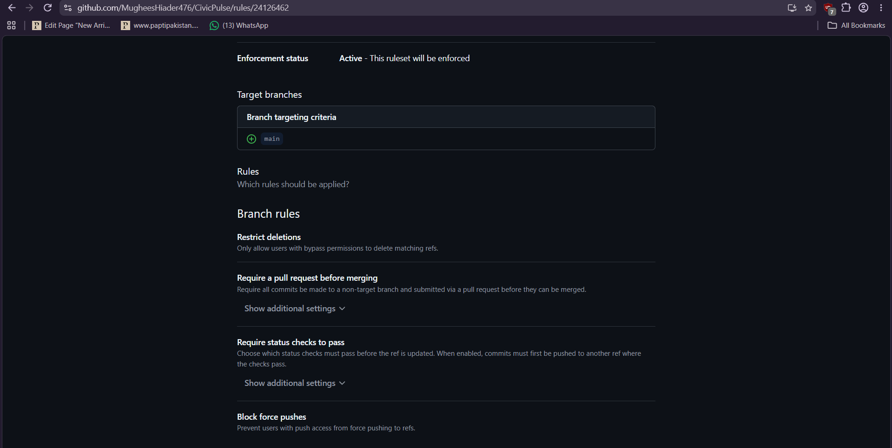

PR #19 deliberately introduced a failing backend regression test. GitHub prevented merging while
both push and pull-request test jobs were red. The failure was then removed in the same PR without
rewriting history. All lint/type, backend/frontend test, manifest, build, integration, Trivy scan,
and SonarCloud checks passed afterward.

The final documented `dev` SHA (`ee0d199`) passed both the
[pull-request CI run](https://github.com/MugheesHiader476/CivicPulse/actions/runs/36563038922)
and the independent [push CI run](https://github.com/MugheesHiader476/CivicPulse/actions/runs/36563033496).
Both runs completed successfully across all required jobs.

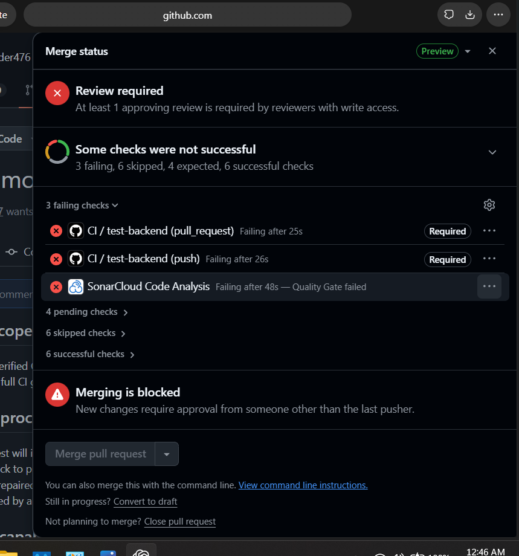

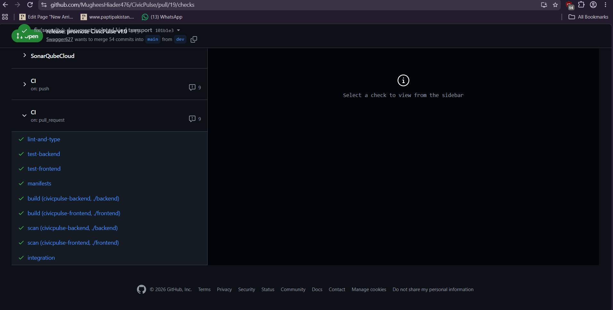

On merge to `main`, CD reruns verification, builds each image once, publishes commit-SHA tags to
GHCR, generates SBOMs, scans the published digests, deploys those exact SHA images to ephemeral
kind, and performs an authenticated Ingress smoke test. A semantic `v1.0.0` tag triggers the release
workflow and attaches backend/frontend SBOMs.

The final [CD run](https://github.com/MugheesHiader476/CivicPulse/actions/runs/36565755282)
completed its test, build-push, and deploy-k8s stages successfully. The final
[Release run](https://github.com/MugheesHiader476/CivicPulse/actions/runs/36566358369)
also succeeded and published release `v1.0.0`.

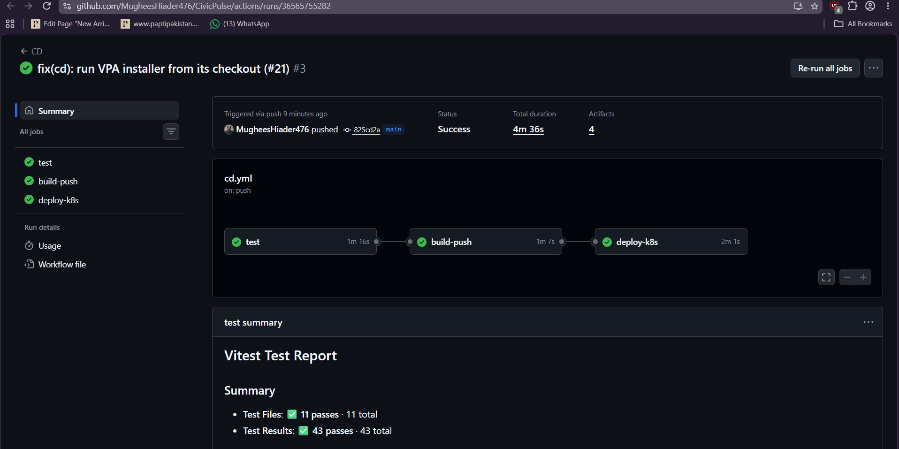

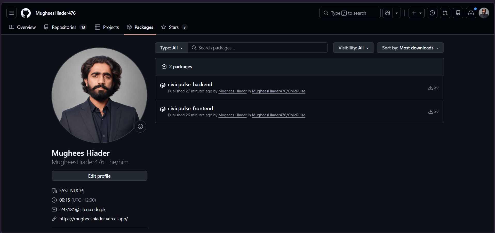

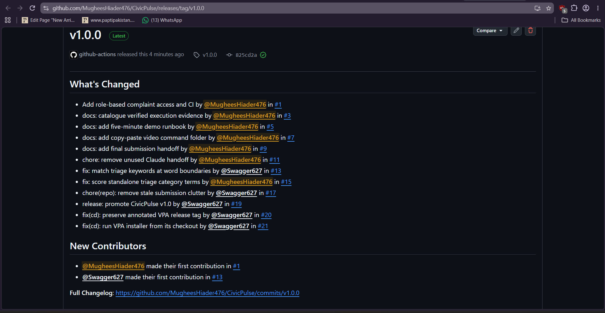

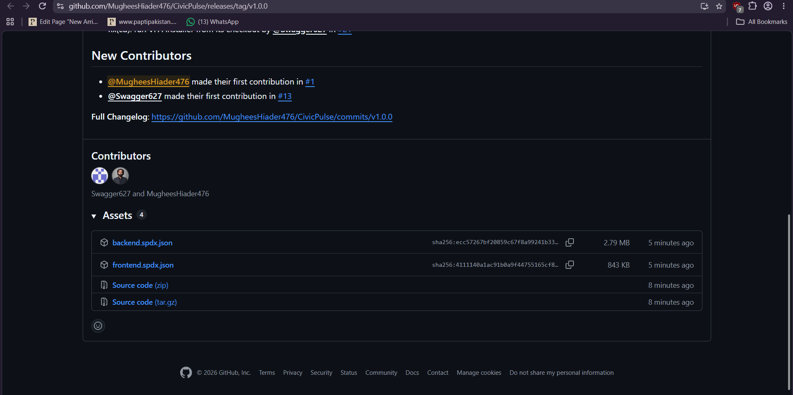

## 9. Failure analysis

During the first real kind deployment, PostgreSQL entered `CrashLoopBackOff`; migration remained at
`Init:0/1` and backend readiness failed. Previous logs showed:

```text
chmod: /var/lib/postgresql/data: Operation not permitted
initdb: error: could not change permissions of directory "/var/lib/postgresql/data"
```

The storage mount root was group-writable but could not be `chmod`ed by UID/GID 70. Setting
`PGDATA=/var/lib/postgresql/data/pgdata` let PostgreSQL create and own a child directory while
preserving the non-root policy. After the controller recreated the failed pod, migration and both
backend replicas became ready. A persistence test deleted `postgres-0` after creating a complaint;
the recreated pod returned the same complaint through Ingress, proving the data remained on the
bound PVC.

## 10. AI assistance and human ownership

The detailed disclosure is `docs/AI-USAGE.md`. Faseeh directed the work, asked questions about the
rubric and implementation, decided what entered the repository, and owns the commits and decisions
recorded under his identity. Codex assisted with Docker, Kubernetes, CI/CD implementation drafts,
repository edits, commands, verification, explanations, and documentation. It does not claim that
it independently authored the students' commits. Human authors remain responsible for reviewing,
explaining, and modifying every submitted line.

## 11. Submission gate

- Mechanical preflight: 0 errors.
- Fresh-clone Compose: verified healthy.
- Application, cache, validation, rate-limit, Kubernetes, HPA, and VPA evidence: captured.
- Protected red-to-green CI: captured and green.
- Partner approval, protected merge, merged-main CD, GHCR publishing, semantic release, and SBOM evidence: complete.
- The final submission PDF contains the captured evidence and has no reserved screenshot or video placeholders.
